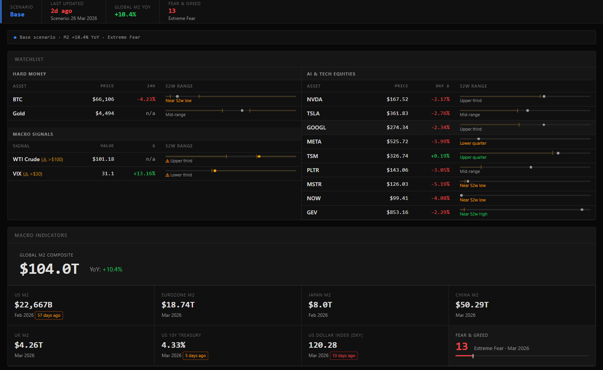
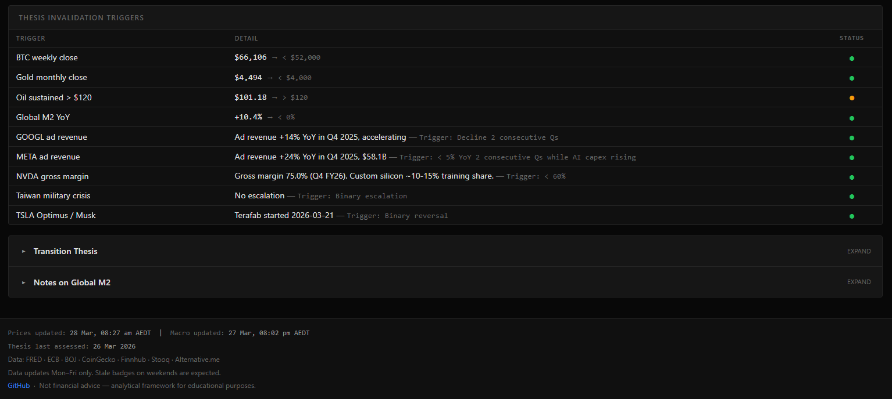

# The Great Transition — Macro Dashboard

A thesis-driven macro dashboard tracking fiat demonetisation, AI deflation, and geopolitical restructuring.

---




---

## What is this?

The dashboard is a personal analytical framework built around a single structural thesis: AI technological deflation and geopolitical de-dollarisation, with both forces converging on the same outcome — sustained global M2 expansion. The thesis has a 2030 horizon. The indicators tracked here are waypoints, not trading signals.

AI is collapsing the cost of intelligence and labour exponentially with models training models and machines building machines at an accelerated pace. The recursive self improvement loop is already running. USD de-dollarisation is structural: central banks accumulated over 1,000 tonnes of gold annually from 2022–2024, dollar reserve share has fallen from 72% to ~57%, and the trend is secular. Both forces make debt harder to service in a debt-based system, which has one historical resolution: monetary expansion. Global military expenditure reached a record $2.4 trillion in 2023 (SIPRI), with European defence budgets accelerating further into 2025–2026 under NATO commitments — largely debt-financed spending that flows directly into M2. Deglobalisation compounds this: each currency bloc must now generate its own liquidity to replace the dollar system's former intermediary role, resulting in structurally higher total global money creation.

The portfolio expression is concentrated in hard money (BTC + gold), with AI and tech equities as satellites and cash as optionality. The dashboard surfaces the indicators that would confirm, stress-test, or invalidate that positioning — not price alerts for short-term trading.

---

## Live Dashboard

[darylcl1984.github.io/macro-dashboard](https://darylcl1984.github.io/macro-dashboard)

---

## Architecture

GitHub Actions acts as a zero-cost, serverless backend. Two scheduled Python scripts fetch data from free and freemium APIs, commit updated JSON files directly to the repository, and GitHub Pages serves the static PWA. No server, no database, no infrastructure.

```
Free APIs
  CoinGecko · Stooq · Yahoo Finance · Alternative.me · BOJ
  Finnhub (free tier) · FRED (free tier)
        │
        ▼
GitHub Actions (cron, Mon–Fri)
  fetch_prices.py   → data/prices.json    (3× daily)
  fetch_macro.py    → data/macro.json     (1× daily)
        │
        ▼
data/ committed to repo (static JSON)
        │
        ▼
GitHub Pages PWA
  app.js reads JSON directly — no build step, no bundler
```

Manual data (`data/manual.json`) covers indicators with no free automated source — Global M2 composite, China M2, UK M2, and scenario assessments. Hand-edited and committed after each update.

The entire pipeline requires no paid infrastructure. The only costs are the two free-tier API keys (FRED and Finnhub), stored as GitHub Actions secrets.

---

## Data Sources

| Source | Provides | Refresh |
|---|---|---|
| [CoinGecko](https://www.coingecko.com/en/api) | BTC price + 24h change | 3× daily (Mon–Fri) |
| [Yahoo Finance](https://finance.yahoo.com) | VIX price + 52-week ranges for all assets | 3× daily (Mon–Fri) |
| [Stooq](https://stooq.com) | WTI Crude, Gold (XAUUSD), USD/JPY | 3× daily (Mon–Fri) |
| [Finnhub](https://finnhub.io) | Equities: NVDA, TSLA, GOOGL, META, TSM, PLTR, MSTR, NOW, GEV | 3× daily (Mon–Fri) |
| [FRED](https://fred.stlouisfed.org) | US M2, US 10Y Treasury yield, US Dollar Index (DXY) | Daily (Mon–Fri) |
| [BOJ](https://www.stat-search.boj.or.jp) | Japan M2 | Daily (Mon–Fri) |
| [Alternative.me](https://alternative.me/crypto/fear-and-greed-index/) | Crypto Fear & Greed Index | Daily (Mon–Fri) |
| Manual (`data/manual.json`) | Global M2 composite, China M2, UK M2, scenario assessments | Quarterly or on event |

Stale data badges appear on the dashboard when a source has not updated within expected cadence. Weekend staleness is expected — all sources are weekday-only.

---

## Dashboard Sections

**Thesis Status Bar** — Top-level regime snapshot: current scenario (Bull / Base / Bear / Tail Risk), Global M2 YoY, and Crypto Fear & Greed.

**Regime Bar** — One-line summary of the current scenario and key levels across BTC, gold, and equities.

**Watchlist** — Hard money (BTC, gold) and macro signals (WTI Crude, VIX) on the left; AI and tech equities on the right. Each row shows price, day change, and a 52-week range bar with configurable alert thresholds.

**Macro Indicators** — Global M2 composite, US M2, EU M2, Japan M2, US 10Y Treasury, DXY, and Fear & Greed gauge. Each card shows current value, date, and source.

**Thesis Invalidation Triggers** — A fixed set of conditions that would require immediate portfolio reassessment. Each row shows current status, threshold, and a green / amber / red signal. Price-based triggers are automated; binary triggers (Taiwan, Optimus) are manually assessed.

**Thesis Narrative** — The full macro thesis and scenario analysis in collapsible sections. Links to `docs/thesis.md` in the repository for offline reference.

---

## Alerts

Alert thresholds are configured in `data/alerts.json`. Each asset can have a `below` and/or `above` price level. When a live price breaches a threshold:

- The dot on the 52-week range bar turns amber
- A `(⚠ < $52,000)` tag appears inline next to the asset name on all screen sizes
- The range descriptor shows a `⚠` prefix

Thresholds are static values in the JSON — edit and commit to update them.

---

## Thesis

The full thesis — macro framework, portfolio construction, indicator guide, invalidation triggers, and scenario analysis — lives in [`docs/thesis.md`](docs/thesis.md) and renders inside the dashboard's collapsible Transition Thesis section.

The short version: fiat debasement is structural, not cyclical. The positions are sized for a 4-year holding period. Every road leads to M2 expansion — the question is timing and drawdown tolerance on the way there.

Not financial advice. For educational and analytical reference only.

---

## Local Development

```bash
git clone https://github.com/darylcl1984/macro-dashboard.git
cd macro-dashboard
```

**API keys** — Export before running the scripts:
```bash
export FRED_API_KEY=your_fred_key       # https://fred.stlouisfed.org/docs/api/api_key.html
export FINNHUB_API_KEY=your_finnhub_key # https://finnhub.io (free tier)
```

**Run scripts manually:**
```bash
pip install requests
python scripts/fetch_prices.py
python scripts/fetch_macro.py
```

**Serve locally:**
```bash
cd src
python -m http.server 8080
# → http://localhost:8080
```

The PWA reads JSON from `../data/` relative to `src/` — the local server must be rooted at `src/` for paths to resolve correctly.

GitHub Actions workflows can be triggered manually from the repository's Actions tab (`workflow_dispatch`) without waiting for the scheduled cron.

---

## License

MIT
