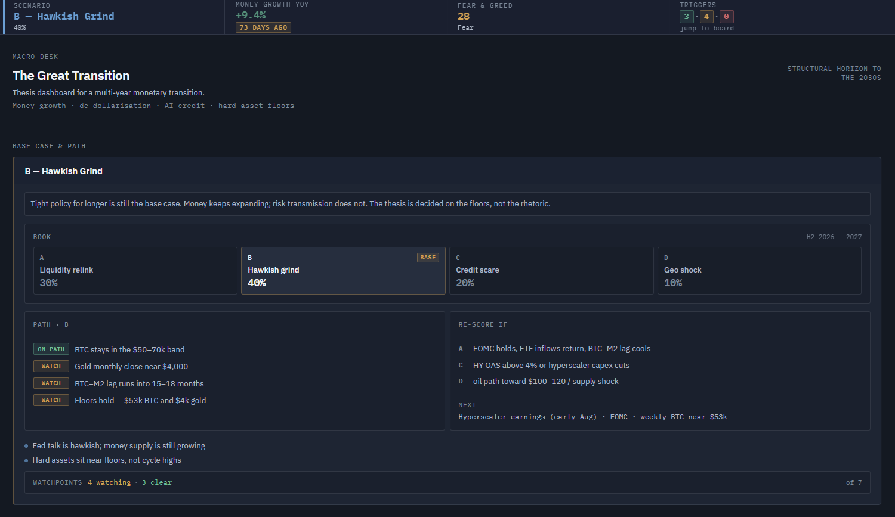
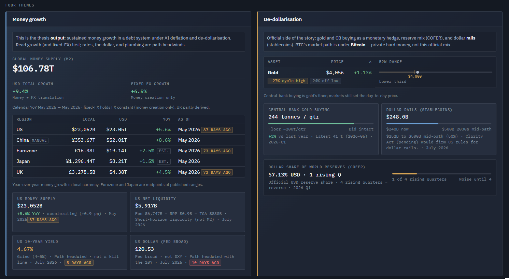
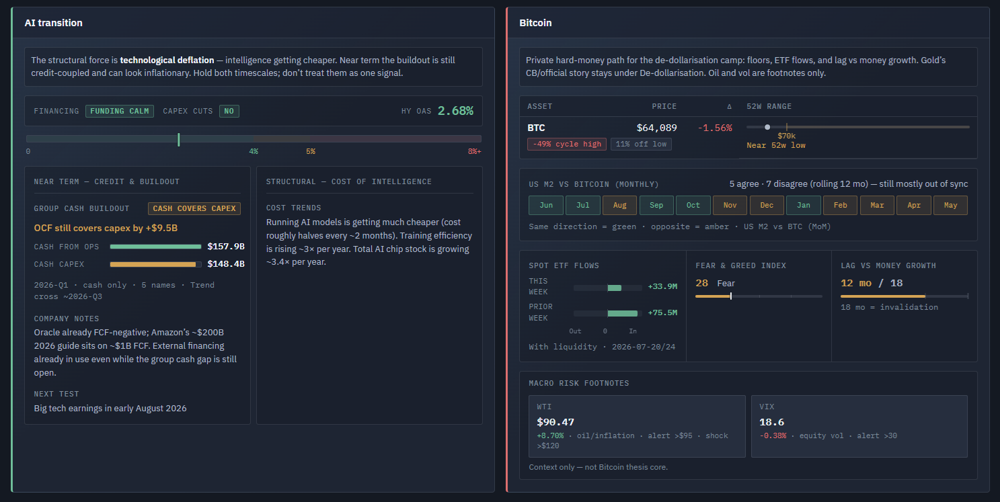
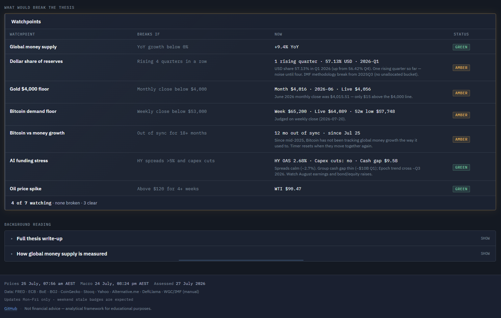

# The Great Transition — Macro Dashboard

Thesis-driven research terminal for a multi-year monetary transition: **AI deflation**, **de-dollarisation**, and their output — **sustained global money growth**. Hard assets (BTC, gold) are the primary beneficiaries. Horizon: the **2030s**.

This desk owns the 2030s floor and which A–D *path* the tape is on. It does not call whether the Jul–Dec 2026 window (`liquidity-monitor`) is in. A Q4 *signal* can print inside hawkish grind (B) without a first cut and without breaking floors. Thresholds are desk-local — a number on one desk does not bind the other.

Waypoints, not trading signals. No portfolio, no positions.

**Live:** [darylcl1984.github.io/macro-dashboard](https://darylcl1984.github.io/macro-dashboard)

**PWA:** Installable from Chrome (desktop/Android) when served over HTTPS — icons + service worker + `manifest.json` under `src/`.

---

## Screenshots









---

## What it tracks

Two structural forces, one output:

| Force | Near term | Structural |
|---|---|---|
| **AI** | Capex / credit-coupled buildout | Cost of intelligence collapsing |
| **De-dollarisation** | COFER counter-cycles, CB gold | Reserve mix + dollar *rails* (stablecoins) |
| **Output** | Fiscal-dominant M2 growth | Debt system under AI deflation → more money |

**Four desk themes** (UI): Money growth · De-dollarisation · AI transition · Bitcoin  

**Scenario book (H2 2026–2027 path, not a 2026-exit verdict):**

| ID | Name | Role |
|---|---|---|
| **A** | Liquidity relink (30%) | Money grows; BTC–M2 transmission heals |
| **B** | Hawkish grind (40%) | **Base** — money grows; transmission blocked |
| **C** | Credit scare (20%) | AI/credit break → forced easing |
| **D** | Geo shock (10%) | Supply shock / stagflation path |

Honesty mechanism: seven **pre-committed watchpoints**. Status is computed in public; corrections are documented, not goalpost-moved.

Full write-up: [`docs/thesis.md`](docs/thesis.md) · M2 methodology: [`docs/m2_note.md`](docs/m2_note.md)

*Not financial advice — analytical framework for educational purposes.*

---

## Architecture

GitHub Actions is a zero-cost backend. Python jobs fetch free/freemium APIs, commit JSON, GitHub Pages serves a static PWA. No server, no database, no bundler.

```
APIs (CoinGecko · Stooq · Yahoo · Alternative.me
      FRED · BOJ · ECB · BoE)
        │
        ▼
GitHub Actions (cron, Mon–Fri)
  fetch_prices.py  → data/prices.json   (3× daily)
  fetch_macro.py   → data/macro.json    (1× daily)
        │
        ▼
data/*.json committed to repo
        │
        ▼
GitHub Pages PWA  (src/app.js reads JSON)
```

**Manual desk** (`data/manual.json`) — no free automated source, or judgment calls:

| Series | Cadence |
|---|---|
| China M2 | Monthly (~14th, PBoC) |
| CB gold (WGC), COFER | Quarterly |
| Hyperscaler OCF vs cash capex ([Epoch](https://epoch.ai/data-insights/hyperscaler-capex-vs-cash-flow)) | Quarterly — see [`docs/ai-hyperscaler-cash.md`](docs/ai-hyperscaler-cash.md) |
| Scenario book, waypoints, rescore cues | As judgment changes |
| ETF flows (Farside) | Weekly when possible |
| Trigger notes (COFER / AI / gold) | As needed |

Only secret: free-tier **FRED API key** (`FRED_API_KEY` in GitHub Actions).

---

## Data sources

| Source | Provides | Refresh |
|---|---|---|
| [CoinGecko](https://www.coingecko.com/en/api) | BTC + 24h change | 3× daily (Mon–Fri) |
| [Yahoo Finance](https://finance.yahoo.com) | VIX + 52-week ranges | 3× daily |
| [Stooq](https://stooq.com) | WTI, gold (XAUUSD), FX for M2 | 3× daily |
| [FRED](https://fred.stlouisfed.org) | US M2, 10Y, broad dollar, HY OAS | Daily |
| [BOJ](https://www.stat-search.boj.or.jp) | Japan M2 | Daily |
| [ECB Data Portal](https://data.ecb.europa.eu) | Eurozone M2 | Daily |
| [Bank of England](https://www.bankofengland.co.uk/boeapps/database/) | UK M4 | Daily |
| [Alternative.me](https://alternative.me/crypto/fear-and-greed-index/) | Crypto Fear & Greed | Daily |
| [Epoch AI](https://epoch.ai/data-insights/hyperscaler-capex-vs-cash-flow) | Hyperscaler OCF vs cash capex (CSV) | Quarterly (manual) |
| Manual (`data/manual.json`) | China M2, CB gold, COFER, AI cash, scenario, ETF notes | Monthly / quarterly |

**Computed in pipeline:** five-bloc Global M2 stock; headline YoY and **fixed-FX** YoY (money creation only). Stale badges fire when a source misses cadence (weekend staleness is expected).

---

## Dashboard layout

1. **Status bar** — Scenario, money growth YoY, Fear & Greed, watchpoint tally  
2. **Path book (H2 2026–2027)** — A–D book, lead judgment, path waypoints (auto where possible), re-score if, next check, live tally  
3. **Four themes**
   - **Money growth** — Global M2, dual YoY, five-bloc table, US M2 / net liquidity / 10Y / broad $  
   - **De-dollarisation** — Gold vs $4k, CB gold, stablecoin rails, COFER  
   - **AI transition** — Group cash buildout (Epoch), HY OAS gauge, cost slopes  
   - **Bitcoin** — $53k floor, US M2 vs BTC months, ETF flows, F&G, lag clock; WTI/VIX as footnotes  
4. **Watchpoints** — Seven lines (money → reserves → gold → BTC cluster → AI → oil)  
5. **Background reading** — Full thesis + M2 methodology note  

Design system: [`docs/design-contract.md`](docs/design-contract.md)

---

## Local development

```bash
git clone https://github.com/darylcl1984/macro-dashboard.git
cd macro-dashboard
```

**API key** (for pipeline scripts):

```bash
# Windows PowerShell
$env:FRED_API_KEY = "your_fred_key"
# macOS / Linux
export FRED_API_KEY=your_fred_key
```

Get a free key: [FRED API key](https://fred.stlouisfed.org/docs/api/api_key.html)

**Fetch data:**

```bash
pip install -r requirements.txt
python scripts/fetch_prices.py
python scripts/fetch_macro.py
```

**Serve the PWA from the repo root** (so both `src/` and `data/` are reachable).  
`app.js` loads JSON as `../data/*.json` from the page URL — that only works if the server root is the **repo**, not `src/` alone. Python’s `http.server` will **404** parent paths if you `cd src` first (empty desk).

```bash
# from repo root
python -m http.server 8080
# → http://localhost:8080/src/
```

Do **not** serve only from `src/` unless you also expose `data/` another way.

GitHub Actions can also be run via **workflow_dispatch** on the Actions tab.

---

## Repo map

| Path | Role |
|---|---|
| `src/` | PWA (HTML / CSS / JS / service worker) |
| `data/` | Live JSON (`prices`, `macro`, `manual`, M2 history) |
| `scripts/` | Fetch jobs |
| `docs/thesis.md` | Full thesis framework |
| `docs/m2_note.md` | Global M2 methodology |
| `docs/ai-hyperscaler-cash.md` | Epoch OCF/capex ingest pointer |
| `docs/research/` | Revision provenance (not rendered) |

---

## License

MIT
