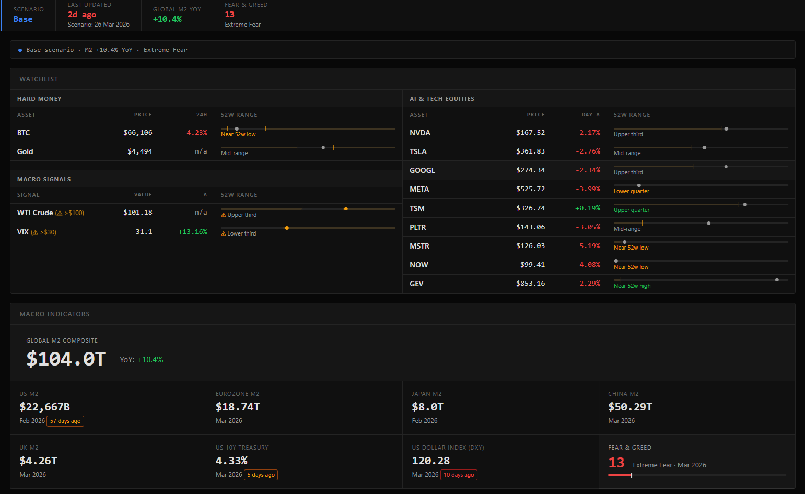
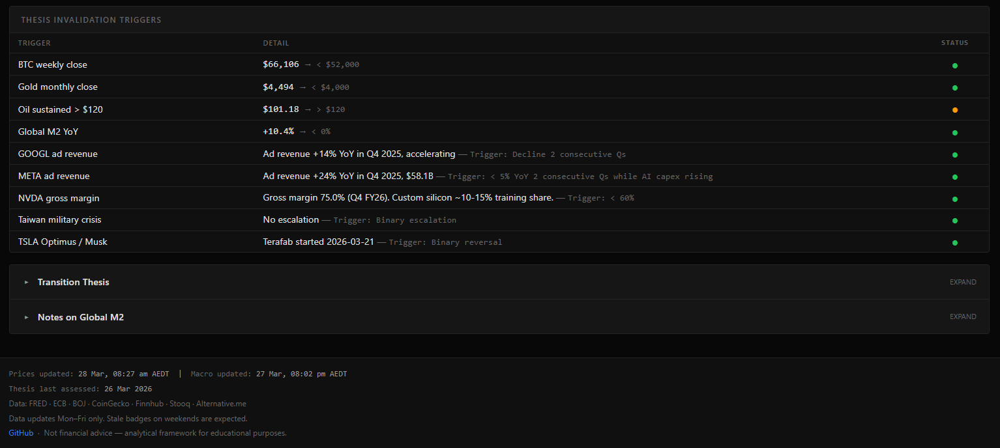

# The Great Transition — Macro Dashboard

A thesis-driven macro dashboard tracking AI-driven technological deflation, geopolitical de-dollarisation, and their convergent output: sustained global monetary expansion.

---




---

## What is this?

A personal analytical framework built around a single structural thesis with a 2030 horizon: AI technological deflation and geopolitical de-dollarisation both make debt harder to service in a debt-based system, which has one historical resolution — monetary expansion. The dashboard surfaces the indicators that confirm, stress-test, or invalidate that thesis. Waypoints, not trading signals. No portfolio, no positions, no price alerts for trading.

The thesis holds two forces in tension with their own counter-currents, honestly tracked:

- **The AI transition runs on two timescales with opposite signs** — a near-term inflationary, credit-coupled capex buildout (hyperscaler capex crossing above operating cash flow ~Q3 2026), and a structural deflation in the cost of intelligence (inference cost at fixed capability halving roughly every two months).
- **De-dollarisation is secular but not monotonic** — central banks bought a record ~850–1,045t of gold annually since 2022 and bought the 2026 crash, while the dollar's COFER reserve share posted its first counter-trend rise in Q1 2026 and stablecoins re-dollarise the rails layer.
- **The monetary expansion is now fiscal-dominant** — US M2 accelerating under the most hawkish Fed pivot in modern history, because a ~$1.9T deficit at full employment prints through the back door.

Everything on the dashboard hangs off one of four pillars: **Monetary Expansion · De-Dollarisation · AI Transition · Hard Money Market State**, plus an auto-computed invalidation trigger board with pre-committed thresholds.

---

## Live Dashboard

[darylcl1984.github.io/macro-dashboard](https://darylcl1984.github.io/macro-dashboard)

---

## Architecture

GitHub Actions acts as a zero-cost, serverless backend. Two scheduled Python scripts fetch data from free and freemium APIs, commit updated JSON files directly to the repository, and GitHub Pages serves the static PWA. No server, no database, no infrastructure, no build step.

```
Free APIs
  CoinGecko · Stooq · Yahoo Finance · Alternative.me
  FRED (free tier) · BOJ · ECB Data Portal · BoE
        │
        ▼
GitHub Actions (cron, Mon–Fri)
  fetch_prices.py   → data/prices.json    (3× daily)
  fetch_macro.py    → data/macro.json     (1× daily)
        │
        ▼
data/ committed to repo (static JSON)
        │
        ▼
GitHub Pages PWA
  app.js reads JSON directly — no bundler
```

Manual data (`data/manual.json`) covers indicators with no free automated source — China M2 (monthly, ~14th), central-bank gold purchases and COFER reserve share (quarterly), AI capex/OCF assessments (quarterly earnings), scenario assessment, and binary triggers. Hand-edited and committed after each update.

The only secret required is a free-tier FRED API key, stored as a GitHub Actions secret.

---

## Data Sources

| Source | Provides | Refresh |
|---|---|---|
| [CoinGecko](https://www.coingecko.com/en/api) | BTC price + 24h change | 3× daily (Mon–Fri) |
| [Yahoo Finance](https://finance.yahoo.com) | VIX + 52-week ranges | 3× daily (Mon–Fri) |
| [Stooq](https://stooq.com) | WTI Crude, Gold (XAUUSD), FX rates for the M2 composite | 3× daily (Mon–Fri) |
| [FRED](https://fred.stlouisfed.org) | US M2, US 10Y, broad dollar index, HY credit spreads (OAS) | Daily (Mon–Fri) |
| [BOJ](https://www.stat-search.boj.or.jp) | Japan M2 | Daily (Mon–Fri) |
| [ECB Data Portal](https://data.ecb.europa.eu) | Eurozone M2 | Daily (Mon–Fri) |
| [Bank of England](https://www.bankofengland.co.uk/boeapps/database/) | UK M4 | Daily (Mon–Fri) |
| [Alternative.me](https://alternative.me/crypto/fear-and-greed-index/) | Crypto Fear & Greed Index | Daily (Mon–Fri) |
| Manual (`data/manual.json`) | China M2, CB gold buying, COFER share, AI capex read, scenario | Monthly / quarterly |

The Global M2 composite and its YoY rate (headline and FX-adjusted) are **computed** by the pipeline from the sources above plus FX rates — not hand-entered. Stale badges appear when a source misses its expected cadence; weekend staleness is expected.

---

## Dashboard Sections

**Thesis Status Bar** — Regime snapshot: current scenario, Global M2 YoY, Fear & Greed, and the trigger board tally (green / amber / red).

**Pillar Panels** — One panel per thesis pillar:

- *Monetary Expansion* — Global M2 composite with per-bloc breakdown, US M2 YoY, US 10Y, broad dollar index.
- *De-Dollarisation* — Gold vs the $4,000 line, central-bank purchases (quarterly), COFER dollar share trend.
- *AI Transition* — Hyperscaler capex/OCF crossover status, HY credit spreads, structural cost slopes.
- *Hard Money Market State* — BTC vs the $53k realized-price floor, BTC–M2 divergence clock, WTI, VIX, Fear & Greed.

**Invalidation Trigger Board** — Eight pre-committed conditions with green/amber/red status. Price- and data-based triggers are computed automatically from live data; binary triggers (Taiwan, COFER, AI financing) are manually assessed.

**Thesis Narrative** — The full thesis and the Global M2 methodology note in collapsible sections, rendered from `docs/thesis.md` and `docs/m2_note.md`.

---

## Thesis

The full framework — thesis, current regime read, indicator guide, invalidation triggers, and scenario tree — lives in [`docs/thesis.md`](docs/thesis.md). The methodology behind the M2 composite (measure definitions, FX-vs-money-creation decomposition, liquidity weighting, the BTC transmission revision) is in [`docs/m2_note.md`](docs/m2_note.md). Research provenance for major revisions is kept in [`docs/research/`](docs/research/).

The short version: fiat debasement is structural, not cyclical. Every road leads to monetary expansion — the question is timing, transmission, and drawdown tolerance on the way there. The framework's honesty mechanism is its trigger board: pre-committed invalidation lines, adjudicated in public, with corrections documented rather than goalposts moved.

Not financial advice. For educational and analytical reference only.

---

## Local Development

```bash
git clone https://github.com/darylcl1984/macro-dashboard.git
cd macro-dashboard
```

**API keys** — Export before running the scripts:
```bash
export FRED_API_KEY=your_fred_key  # https://fred.stlouisfed.org/docs/api/api_key.html
```

**Run scripts manually:**
```bash
pip install requests
python scripts/fetch_prices.py
python scripts/fetch_macro.py
```

**Serve locally:**
```bash
cd src
python -m http.server 8080
# → http://localhost:8080
```

The PWA reads JSON from `../data/` relative to `src/` — the local server must be rooted at `src/` for paths to resolve correctly.

GitHub Actions workflows can be triggered manually from the repository's Actions tab (`workflow_dispatch`).

---

## License

MIT
