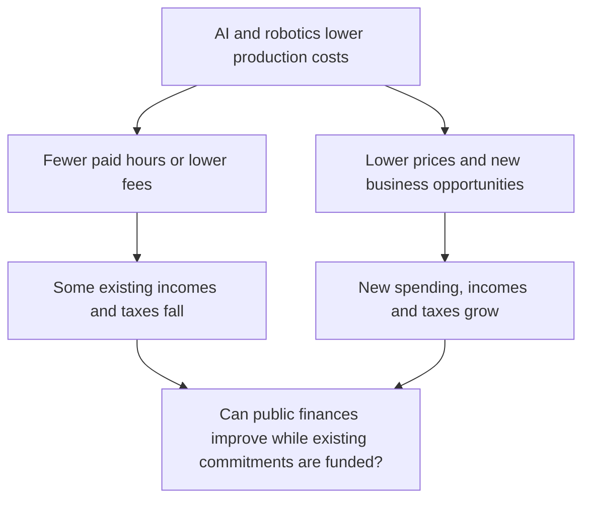

# The Great Transition

*Technology accelerates a monetary transition already shaped by debt, fiscal commitments and reserve diversification.*

Discussion draft · 10 September 2026 · Revised for clarity

What happens when producing things gets much cheaper, but the debts built around yesterday’s economy remain?

A business can cut the cost of its software, research or factory work. Part of that saving may come from paying for fewer hours of work, or paying less for services. What is a saving for the buyer can be a loss of income for the worker or supplier.

For governments, that matters because wages, profits and spending generate tax receipts. If existing incomes fall, some of those receipts can fall too, while pensions, public services and debt payments still need funding. Cheaper production can also create new businesses and new spending, rebuilding the tax base. The question is how quickly the new income replaces what has been lost.

This thesis follows that tension through three changes:

1. **Technological deflation:** AI and robotics make more work cheaper to perform.
2. **Fiscal dominance:** governments invest in growth and support the economy, increasing pressure to make their debts affordable.
3. **Hard-money monetization:** gold and Bitcoin attract a larger share of the world's demand to store wealth.

The dollar can become more widely used along the way. More people using dollars for payments does not mean they want to hold thirty-year dollar promises. The distinction between money for spending and assets for saving is central to the argument.

The horizon is the 2030s, with the pace of change potentially accelerating much sooner.

## 1. Technological deflation

Think of AI progress in terms of the work it can take on. First, a task that takes a skilled person an hour. Then two hours. Then four. Then a working day.

METR measures this using technical tasks with human completion times. Its **50% time horizon** is the task length at which an AI agent is expected to succeed half the time. The hours describe the human effort involved; the AI may finish much faster. The tasks are mainly software and related technical work. [METR’s explanation](https://metr.org/time-horizons/)

The published results give that progress a human scale:

| Model release | Task length at 50% AI success, measured in human work |
|---|---:|
| Claude 3.5 Sonnet · June 2024 | About 11 minutes |
| Claude 3.7 Sonnet · February 2025 | About 1 hour |
| GPT-5 · August 2025 | About 3 hours 23 minutes |

These are estimates for METR’s tested agent setups, with substantial uncertainty. They use its revised Time Horizon 1.1 data, rather than mixing results from different versions of the benchmark. [Published measurements](https://metr.org/assets/benchmark_results_1_1.yaml)

Epoch connects this progress to its broader capability index, ECI. At the index’s launch, roughly five additional points corresponded to a doubling of METR task duration. Think **one hour → two → four → eight**: a steady climb in the index can represent a large change in the work machines can handle. That relationship is approximate, and eight times the task length does not mean eight times the productivity. [Epoch’s calibration](https://epoch.ai/data/eci-documentation/faq)

**Where does that put the latest models?** The METR data checked for this draft contain no published duration for Astra or Fable 5.1. Extending the same rule beyond the measured range gives the following illustration:

| September 2026 model | ECI | Expert task-hours implied by extending the rule | Evidence status |
|---|---:|---:|---|
| Claude Fable 5.1 | 164.24 | About **25 hours** | Unvalidated extrapolation; no matched METR result |
| GPT-6 Astra | 166.57 | About **34 hours** | Unvalidated extrapolation; no matched METR result |

These figures show what the historical relationship would imply, **not demonstrated ability to complete a 25- or 34-hour task**. They are beyond the range checked for the dashboard’s axis; METR also warns that estimates above 16 hours are unreliable with its current task suite. Read them as a sense of potential scale, rather than hours of work already proven automatable. [ECI scores and calculation](research/thesis-evidence-2026-09-10.md#latest-model-duration-illustrations), [METR’s limits](https://metr.org/time-horizons/)

Now add the ability to run many copies at once. A firm can give separate tasks to many agents, then have people check the results. As those agents become more capable and need less correction, the cost of completed work falls. That is the economic measure that matters: what it costs to get an acceptable result.

AI also helps develop better AI. OpenAI reports that its researchers already use agents to write code and run experiments, with people still directing and judging the work. That creates a feedback loop: [Research workflows](https://openai.com/index/research-acceleration-view-inside-openai/)

Frontier mathematics gives a sense of the ambition. Navier–Stokes equations describe how fluids such as air and water move. The famous mathematical problem asks whether initially smooth three-dimensional flows always remain well behaved, or can develop a singularity—a point where the mathematical description breaks down.

In 2000, the Clay Mathematics Institute selected it as one of seven **Millennium Prize Problems**: longstanding questions chosen for their depth and difficulty, with **$1 million allocated to each solution**. These are major open problems at the research frontier, rather than difficult examination questions. [Clay Mathematics Institute](https://www.claymath.org/millennium-problems/)

On 8 September 2026, OpenAI published what it describes as a solution, with a proof formalized in Lean, a system for computer-checking mathematics. It attributes the result to an internal AI more capable than GPT-6 Astra. OpenAI describes the underlying question as unresolved for roughly 90 years. This is a published research claim, distinct from an independently accepted solution or a prize award. Its economic relevance is the prospect of AI contributing to discoveries that expand what the next generation of technology can do. [OpenAI’s publication](https://openai.com/index/navier-stokes-solution/)

Robotics brings the same possibility to physical work. A machine can handle immediate movements locally and ask a more capable system for help with unfamiliar situations. Better software can make an installed fleet more useful. Hardware, power, maintenance and safety still set limits, but every improvement need not require a new robot.

The working expectation in September 2026 is that this year’s agents and workflows enable a substantial economic acceleration in 2027. Look for less supervision, wider adoption and lower costs for completed work. Those changes matter more than agreement on the label “AGI.”

Lower costs can initially become higher profits. Over time, competition gives firms a reason to offer lower prices and reach more customers. That is **technological deflation**: downward pressure on prices as production gets cheaper.

It will be uneven. Electricity and construction can become more expensive during the build-out while digital services become cheaper. Across the economy, prices can still fall despite monetary expansion if useful output grows faster than spending.

## 2. Fiscal dominance

Imagine an economy producing 8% more goods and services, with prices across that output falling 5%. A simplified example makes the difference between output and dollar income visible:

| Illustrative economy | Output | Price per unit | Total dollar value |
|---|---:|---:|---:|
| Before | 100 units | $1.00 | $100.00 |
| After | 108 units | $0.95 | $102.60 |
| Change | **+8%** | **−5%** | **+2.6%** |

That is good news for what people can afford. It is less powerful help for a government trying to shrink its debt relative to the dollar value of the economy. Existing debt payments do not automatically fall with production costs.

The starting burden is already large. US gross federal debt was about 122.6% of GDP in Q1 2026, the latest observation available when this draft was checked. That measure includes debt held within government as well as by outside investors. [FRED debt/GDP](https://fred.stlouisfed.org/series/GFDEGDQ188S)

Governments have a strong incentive to grow their way out. Spending on AI, energy, infrastructure and domestic production promises a larger future economy. But they also face pressure to support incomes through disruption while maintaining pensions, public services and other commitments.

Technology can help both sides of the budget. New businesses can generate taxes, and public services can become cheaper to deliver. The question is whether those gains arrive fast enough to outweigh support costs, interest payments and lost income elsewhere.

This thesis expects governments to resist a sharp fall in incomes while continuing to invest in growth. Spending cuts impose immediate losses on identifiable groups. Borrowing and supporting demand spread the adjustment over time. That creates pressure to keep government financing affordable.

When those financing needs increasingly constrain interest-rate and monetary policy, the result is **fiscal dominance**. Governments need not explicitly order central banks to finance them. The constraint can emerge through the economic and political cost of allowing borrowing costs to remain high.

There are several ways to respond: lower interest rates, encourage institutions to hold more government debt, or use central-bank purchases to support financing. Deficits, bond sales and money creation are different steps; borrowing a dollar does not automatically add a dollar to M2. The expectation is pressure towards easier financing and monetary expansion over time.

The United States has another advantage: it can distribute dollars more widely through stablecoins. These are digital tokens designed to hold a dollar value, accessible through internet applications. The Treasury has explicitly promoted them as a way to expand dollar use and demand for US government debt. [Treasury’s statement](https://home.treasury.gov/news/press-releases/sb0197)

Consider a business in a country with an unreliable currency. It starts holding dollar stablecoins. The issuer holds reserve assets against those tokens, including short-term dollar instruments. Easier access can bring more people and businesses into the dollar system.

But a user moving an existing dollar balance into a stablecoin may simply change how those dollars are held. Token growth therefore does not measure new dollar demand on its own. [IMF on currency substitution](https://www.imf.org/en/news/articles/2026/08/07/sp080726-stablecoins-emerging-markets-dan-katz)

The duration of the backing assets matters too. A buyer comfortable holding a Treasury bill for a few months has made a different decision from one lending to the government for thirty years. A stronger short-term funding base can buy the US time without resolving its long-term debt problem.

Other large currencies do not automatically offer an escape. A reserve manager choosing between US, Chinese, European and Japanese debt still has to consider access, currency risk and the issuing government’s finances. Adding their money stocks together in dollars does not make those savings equally available to world markets. [Global-money methodology](m2_note.md)

The expected outcome is wider dollar use alongside continued pressure to expand money and debt. That brings us to where governments and institutions choose to store accumulated wealth.

## 3. Hard-money monetization

A computer can get cheaper in dollars while an ounce of gold gets more expensive. There is no contradiction: one is becoming easier to produce, while demand for the other may be growing faster than its supply.

This is the bridge between abundance and scarce assets. Governments can sustain spending while technology expands the supply of goods. At the same time, holders of large savings and reserves may seek assets whose supply cannot expand as easily as money and debt.

Gold and Bitcoin gain a **monetary premium** when buyers value them as places to hold wealth. An increase in that role is **monetization**. The thesis expects them to capture more of the value currently stored in long-term promises from governments and other issuers.

That process does not require the dollar to stop working. Different assets can serve different purposes:

| Monetary role | What the holder needs | Where the thesis sees demand |
|---|---|---|
| Payments and working balances | Convenient pricing, settlement and access to credit | Dollars, including dollar stablecoins |
| Government financing and collateral | Liquid claims that can earn interest or secure borrowing | Treasuries; demand can differ sharply between bills and long bonds |
| Long-term reserve and savings assets | Scarcity and less dependence on an issuer’s promises | Gold and Bitcoin |

The dollar can strengthen in the first role while gold and Bitcoin gain ground in the third.

Nor does buying a hard asset make dollars disappear. The seller receives them. Prices rise when new buyers are willing to pay more and existing holders demand more to sell. What changes is the value placed on owning a share of the scarce asset.

For reserve managers, waiting can become costly. If they expect continued monetary expansion and believe other institutions will diversify, buying earlier can secure the desired holdings at a lower price. That gives governments a strategic reason to accumulate, even while they continue using dollars.

Geopolitics adds a separate incentive. Russia’s frozen central-bank assets demonstrated that access to reserves held abroad depends on the jurisdiction and political relationship. The EU distinguishes the immobilised assets from the revenues generated by them. The lesson for other reserve holders is about control over access to their wealth. [Council of the EU](https://www.consilium.europa.eu/en/policies/sanctions-against-russia-explained/)

Gold already serves this official reserve role. It has no issuing government and can be stored domestically. Central-bank buying provides evidence to watch: the World Gold Council estimated about 289 tonnes of net central-bank and other institutional demand in Q2 2026. Purchases vary, and a rising gold share in reserves can also reflect a higher gold price. [World Gold Council](https://www.gold.org/goldhub/research/gold-demand-trends/gold-demand-trends-q2-2026/central-banks)

Bitcoin provides a scarce asset that can be held and transferred over the internet. Ownership and supply can be verified through its network, and transferring it does not require moving bullion. That makes it a potential complement to gold for holding and moving wealth online.

Their trade-offs differ. Gold needs storage, transport and verification; foreign custody can expose it to restrictions. Bitcoin needs secure key management and a functioning network, and its price is much less settled. Wider ownership and deeper markets could reduce volatility, but growth in market value does not guarantee stability.

The expectation is that gold retains the larger official role while Bitcoin gains a smaller, meaningful share of the world’s reserve and savings assets. No fixed split is required.

The United States could pursue both wider dollar use and greater hard-asset ownership. Its March 2025 Bitcoin reserve order specified retention of eligible forfeited coins and the development of budget-neutral acquisition strategies. That establishes a policy direction; the order alone is not evidence of later market purchases. [US reserve order](https://www.whitehouse.gov/presidential-actions/2025/03/establishment-of-the-strategic-bitcoin-reserve-and-united-states-digital-asset-stockpile/)

Other forms of scarcity also matter. Desirable locations, human attention, art and collectibles can retain value as manufactured goods become abundant. An identical cup is not the cup Elvis drank from. Yet uniqueness alone does not make something suitable for holding reserves at global scale: buyers also need trust, liquidity and a practical way to transfer ownership.

## 4. How it could unfold

**The central path:** AI spreads quickly, production gets cheaper and governments support incomes while investing in growth. Dollar access expands. Gold and Bitcoin attract more demand to store wealth outside sovereign promises.

**The slower path:** integration, energy and physical infrastructure delay the gains. Existing debt and reserve pressures continue, but technology takes longer to amplify them. The build-out may initially raise some prices.

**The strongest alternative:** technology repairs public finances. New activity generates enough taxes, and cheaper public services save enough money, to outweigh disruption and support costs. Debt becomes more manageable and pressure for monetary accommodation fades. That would weaken a central link in this thesis, even if geopolitical reserve diversification continued.

## 5. What would change the thesis

Three kinds of evidence would matter:

- **Slower deployment:** impressive AI capabilities fail to translate into affordable, dependable work. The expected timetable moves back.
- **Better public finances:** productivity brings sustained improvements in receipts, spending and debt ratios. The pressure to expand money weakens.
- **Different reserve choices:** diversification happens, but other assets capture the demand. Gold and Bitcoin must earn their roles through adoption, liquidity and trust. Bitcoin also faces technical and governance challenges, including how to respond to future quantum capabilities.

The dashboard tracks the three stages. Its charts show capability, financing conditions and monetary demand; they do not yet measure all the connections between them. Falling costs, actual adoption and government responses still need research beyond the charts.

The central expectation is that technology makes more things abundant while governments manage the debts and promises of the earlier economy. In that adjustment, credible scarcity becomes more valuable as a place to hold wealth.

---

Sources, definitions and the underlying reasoning are recorded in the [companion evidence note](research/thesis-evidence-2026-09-10.md). The framework draws on Jeff Booth, Ray Kurzweil, Michael Saylor and Brent Johnson; the connections between their ideas are this thesis’s own argument.
